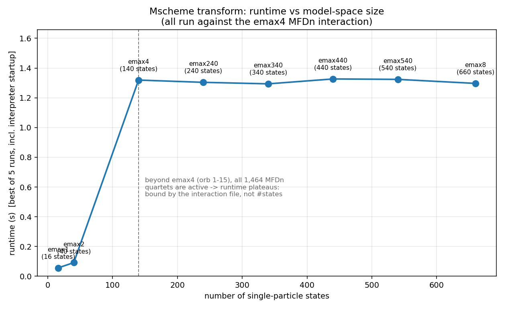
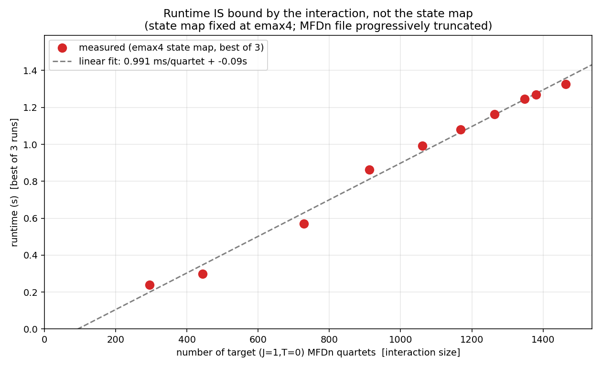

# Mscheme transform — performance notes

This document records the optimization of `Mscheme.py` (the coupled-JT → M-scheme
two-body matrix-element transform) and a key finding about how its runtime scales.

## TL;DR

- The transform was sped up by **~600×** on the full emax4 case (≈15 min → ~1.3 s),
  with output verified **byte-for-byte identical** at every model space.
- **Runtime is set by the interaction (MFDn) file, not the single-particle model
  space.** It scales ~linearly at **≈1 ms per target (J=1, T=0) MFDn quartet** and is
  essentially flat in the number of single-particle states.

## What changed

| # | Optimization | Effect |
|---|--------------|--------|
| 1 | Numeric stdlib Clebsch–Gordan (`cg_numeric.py`, `math.lgamma`, memoized) replacing SymPy's symbolic CG | ~100–1000× per CG call; removes SymPy from the runtime path |
| 2 | Index MFDn records by orbital quartet (dict) instead of re-scanning all records per quartet | O(N²) → O(N) lookup |
| 3 | Pair-bucketing on the conserved `(M, MT)` quantum numbers | quartet build O(n⁴) → O(n² + #valid) |
| 4 | **Drive the transform directly from the MFDn quartets** — enumerate only the m-scheme substate quartets that can contribute (~563k of 15.4M conserved at emax4) | removes the ~93% of time spent rejecting unmatched quartets |
| 5 | Kinetic energy: group orbitals by `(l, j, m, mt)` | O(states²) → O(states) |
| 6 | `pair_channel` from the `mt` sum instead of `tuple(sorted(...))` | removes an allocation from the hot loop |
| 7 | CLI-parametrized paths (`--state-map / --mfdn / --out-mscheme / --out-tsingle`) | one script handles any model space |

All changes preserve output ordering, so `Mscheme.csv` and `Tsingle.csv` stay
byte-identical (the only exception is the symbolic→numeric CG swap, which agrees
to ~1e-15 and was validated against SymPy to <1e-12 in `validate_cg.py`).

Representative timings (against the emax4 MFDn):

| Model space | states | original | now |
|---|---|---|---|
| emax1 | 16 | ~44 s | 0.05 s |
| emax2 | 40 | 5.9 s | 0.09 s |
| emax4 | 140 | ~15 min+ | 1.3 s |

## Key finding: runtime is interaction-bound, not model-space-bound

Because the transform is driven by the MFDn quartets, the cost depends on the
**interaction file**, not on how many single-particle states the map contains.

### Flat vs. number of states

Running every available state map (16 → 660 states) against the **same** emax4 MFDn
gives a flat runtime: once the map covers the orbitals the interaction references
(orb_ids 1–15, reached at emax4 / 140 states), adding more orbitals changes nothing —
they never appear in the interaction, so they contribute zero matrix elements.



| state map | states | runtime |
|---|---|---|
| emax1 | 16 | 0.056 s |
| emax2 | 40 | 0.092 s |
| emax4 | 140 | 1.319 s |
| emax240 | 240 | 1.304 s |
| emax340 | 340 | 1.294 s |
| emax440 | 440 | 1.327 s |
| emax540 | 540 | 1.324 s |
| emax8 | 660 | 1.297 s |

(The larger maps *are* fully processed — the kinetic-energy output `Tsingle.csv`
grows with the state count, 220 → 1332 rows — but the `Mscheme.csv` transform is
identical to emax4 because the emax4 interaction is the ceiling.)

### Linear vs. interaction size

Holding the state map fixed (emax4) and progressively truncating the MFDn file, the
runtime falls in lockstep with the number of target quartets — a clean straight line
at **≈1 ms / quartet**.



| MFDn kept | target quartets | output rows | runtime |
|---|---|---|---|
| 25% | 582 | 38,753 | 0.45 s |
| 50% | 1,061 | 77,273 | 1.01 s |
| 75% | 1,303 | 91,353 | 1.20 s |
| 100% | 1,464 | 101,937 | 1.29 s |

## Practical implications

- To estimate runtime for a new interaction, count its target (J=1, T=0) quartets and
  multiply by ~1 ms (on the reference machine). A future emax6/8 MFDn with, say, 10–50×
  more quartets would take roughly 10–50× as long.
- The single-particle space can grow freely with negligible cost (only the kinetic
  energy scales, and it is now O(states)).
- The next optimization lever — relevant only once a **larger MFDn interaction** is
  used — is parallelism: the MFDn orbital quartets are independent, so the decoupling
  loop parallelizes near-linearly across cores (or via NumPy on the CG accumulation).

## Reproducing

```bash
# run any model space (defaults reproduce the original emax1 run)
python3 Mscheme.py --state-map emax4_state_map.csv \
                   --mfdn Helium_2_data_N3LO_EM500_srg1.0_hw16_emax4_e2max8.MFDn \
                   --out-mscheme Mscheme.csv --out-tsingle Tsingle.csv
```

Correctness is checked by diffing outputs against archived golden references
(`refs/`); the numeric Clebsch–Gordan is cross-checked against SymPy in
`validate_cg.py`.
